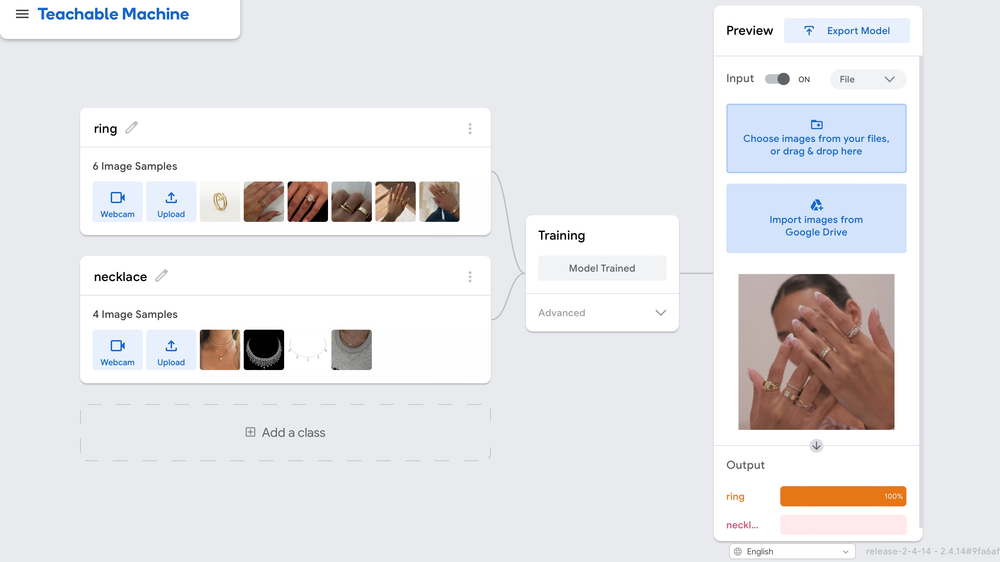
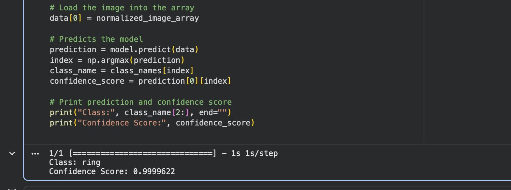
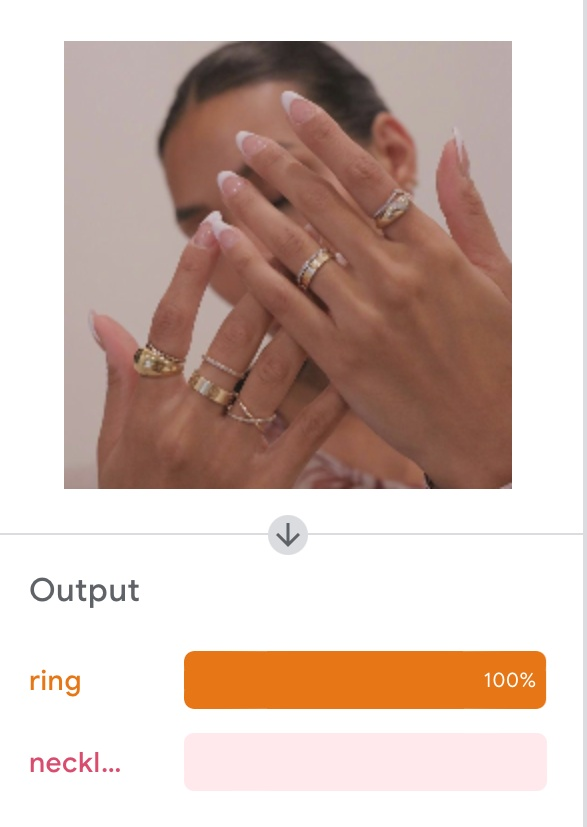

# AI-imge-classification# 
## Project Overview

In this project, I used **Google Teachable Machine** to build an image classification model that can recognize two types of jewelry: **rings** and **necklaces**. After training the model with my own dataset, I exported it as a TensorFlow model and tested it using Python in Google Colab. This project helped me understand the complete workflow of creating and using an image classification model.

---

## Table of Contents

- Prerequisites
- Project Steps
- Dataset
- Model Training
- Code Implementation
- Results
- Technologies Used
- Future Improvements

---

## Prerequisites

Before starting this project, I used the following tools:

- Google Teachable Machine
- Google Colab
- Python
- TensorFlow
- NumPy
- Pillow (PIL)

---

## Project Steps

### 1. Create the Project

I started by opening **Google Teachable Machine** and creating a new **Standard Image Project**.

### 2. Define Classes

Next, I created two classes for my model:

- Ring
- Necklace

### 3. Collect Images

I collected and uploaded images for each class. I tried to use images with different backgrounds and angles to help the model learn and improve its predictions.

### 4. Train the Model

After uploading the images, I trained the model using Teachable Machine. Once the training was complete, I tested the model to make sure it could correctly recognize each category.

### 5. Export the Model

When I was satisfied with the results, I exported the model as **TensorFlow (Keras)**.

The exported files were:

- `keras_model.h5`
- `labels.txt`

### 6. Test the Model

I opened **Google Colab**, uploaded the exported files, and used Python to load the model. Then I tested it with new images to see if it could correctly classify them.

---

## Dataset

For this project, I created a dataset that contains two categories:

- Ring
- Necklace

The images were used to train and test the model.

---

## Code Implementation

In Google Colab, I wrote Python code to:

- Load the trained TensorFlow model.
- Read the labels file.
- Load and preprocess the input image.
- Run the prediction.
- Display the predicted class and confidence score.
'''from keras.models import load_model  # TensorFlow is required for Keras to work
from PIL import Image, ImageOps  # Install pillow instead of PIL
import numpy as np
import tf_keras as tk

# Disable scientific notation for clarity
np.set_printoptions(suppress=True)

# Load the model
model = tk.models.load_model("keras_model.h5", compile=False)

# Load the labels
class_names = open("labels.txt", "r").readlines()

# Create the array of the right shape to feed into the keras model
# The 'length' or number of images you can put into the array is
# determined by the first position in the shape tuple, in this case 1
data = np.ndarray(shape=(1, 224, 224, 3), dtype=np.float32)

# Replace this with the path to your image
image = Image.open("IMG_4055.JPG").convert("RGB")

# resizing the image to be at least 224x224 and then cropping from the center
size = (224, 224)
image = ImageOps.fit(image, size, Image.Resampling.LANCZOS)

# turn the image into a numpy array
image_array = np.asarray(image)

# Normalize the image
normalized_image_array = (image_array.astype(np.float32) / 127.5) - 1

# Load the image into the array
data[0] = normalized_image_array

# Predicts the model
prediction = model.predict(data)
index = np.argmax(prediction)
class_name = class_names[index]
confidence_score = prediction[0][index]

# Print prediction and confidence score
print("Class:", class_name[2:], end="")
print("Confidence Score:", confidence_score)
'''
---

## Results

The model was able to correctly classify the test images. In the example below, the model predicted the image as **Ring** with **100% confidence**.

---

## Technologies Used

- Google Teachable Machine
- Python
- TensorFlow
- Google Colab
- NumPy
- Pillow (PIL)

---
You can open and run the notebook directly in Google Colab:

[Open in Google Colab](https://colab.research.google.com/drive/1n6iWkuVI5aj-s6YjTjKBtcR26pUvTvjz?usp=sharing)
